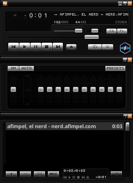
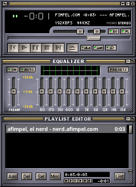
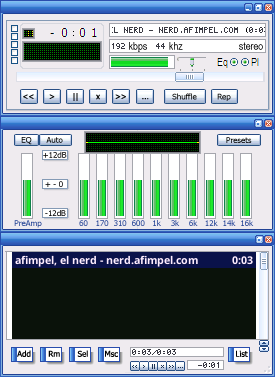

# audacious-skin
son temas para audacious tipo Winamp Classic

## Screenshot

<table>
  <tr>
    <td></td>
    <td></td>
   </tr> 
   <tr>
    <td></td>
    <td></td>
  </td>
  </tr>
</table>

## INSTAL

 1) ***como usurio comun*** (por consola)

```bash
wget --no-cache -O - https://raw.githubusercontent.com/afimpel/audacious-skin/main/setup-audacious-skin.sh | bash
```
